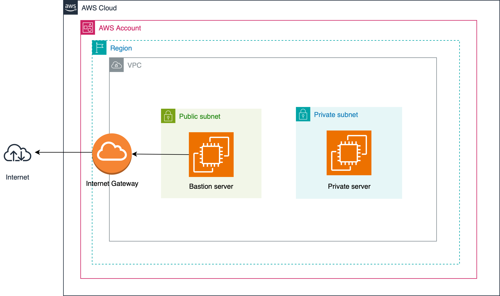

## Bastion Host

This projects sets up a **bastion host** in AWS.
A bastion host is a secure entry point that enables authorized users to access private infrastructure or internal systems without exposing them to the public internet.



1. Create VPC
2. Create Subnets:
   1. Public
   2. Private
3. Create Internet Gateway (IGW):
   1. Attach IGW to VPC
4. Create Route Tables:
   1. Public Route table: 
      - default local route
      - route 0.0.0.0/0 -> IGW
   2. Private Route table:
      - default route only
5. Associate Route tables with subnets:
   1. Associate public route table with public subnet
   2. Associate private route table with private subnet
6. Launch EC2 Instances:
   1. Bastion:
      1. Enable Auto-assign public IP
      2. Put in public subnet
   2. Private server:
      1. Disable Auto-assign public IP
      2. Put in private subnet
7. Security Groups:
   1. Bastion server - allow SSH traffic (port 22) from your IP only.
   2. Private server - allow SSH traffic from the Bastion security group (use the security group ID as source)
8. Configure SSH in local machine. In your `~/.ssh/config`:
    ```
    Host bastion
        HostName <bastion-public-ip>
        User <bastion-user>
        IdentityFile <path-to-bastion-private-key>

    Host private-server
        HostName <private-server-ip>
        User <private-server-user>
        ProxyJump bastion
        IdentityFile <path-to-private-server-private-key>
    ```

Finally, connect to the private server:
```
ssh private-server
```

TODO - automate setup with Terraform
