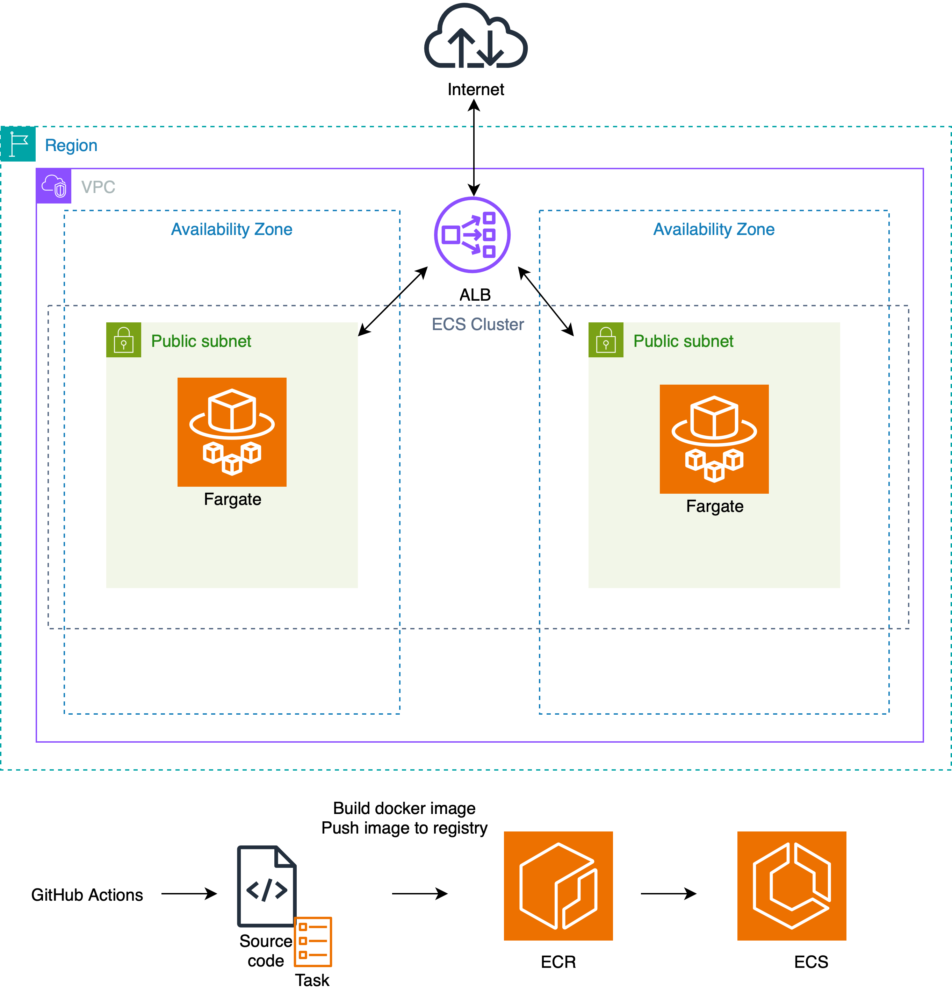

## Deploy the app to Amazon ECS Fargate

**Note**: AWS Fargate does **not** offer a free tier.

### Overview
Terraform manages the infrastructure (cluster, service, ALB, networking, etc).

GitHub Actions handle:
  - updating the docker image (build, push)
  - registering a new task definition revision
  - deploying the updated task revision to ECS



GitHub Actions workflow: `deploy-fargate.yml`

Required secrets for the workflow:
  - AWS_ACCESS_KEY_ID
  - AWS_SECRET_ACCESS_KEY
  - AWS_ACCOUNT_ID
  - ECS_CLUSTER_NAME
  - ECS_SERVICE_NAME

### Steps
The ECS Task Definition file is managed outside Terraform to decouple the app livecycle from the infrastructure lifecycle and simplify images updates via CI/CD.

However, Terraform requires a Task Definition when creating an ECS Service which in turn requires an image. Therefore, the initial deployment requires some manual labor:

1. Create ECR repository:
```
aws ecr create-repository \
    --repository-name fargate_repo \
    --image-tag-mutability MUTABLE
```
Save the `repositoryUri` attribute, it will be needed.

If you missed it, you can check it in the ECR console or via the aws cli:
```
aws ecr describe-repositories
```

2. Build and tag the docker image
```
docker build -t <image_name> .
docker tag <image_name> <repositoryUri>:image_tag
```

3. Login to the registry and push image
```
aws ecr get-login-password --region us-east-1 | docker login --username AWS --password-stdin <your-repository>

docker push <repositoryUri>:image_tag
```

4. In the terraform directory, create and populate your `variables.tfvars` file.
Then:
```
terraform init
terraform apply -var-file=”variables.tfvars”
```
Note: Provisioning the Application Load Balancer takes around 5 minutes.

5. View your app (Terraform outputs the ALB DNS):
```
curl http://<alb-dns>:80
```
Or open it in the browser.

6. For a new app deployment, trigger the worlflow.

#### Cleanup
When no longer needed, destroy the infrastructure:
```
terraform destroy
```

Delete ECR repository:
```
aws ecr delete-repository \
    --repository-name fargate_repo
```
